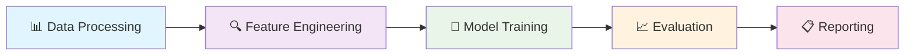

# 🚀 Machine Learning Assignment - NEON1 Team

<div align="center">


### *Khám phá thế giới Machine Learning thông qua các bài tập thực hành*

</div>

---

## 📚 **Thông tin Môn học**

<div align="center">

| 🎓 **Môn học** | 🔢 **Mã môn** | 👨‍🏫 **Giảng viên** |
|:-------------:|:------------:|:------------------:|
| **Học máy (Machine Learning)** | **CO3117** | **TS. Lê Thành Sách** |

</div>

---

## 👥 **Thành viên nhóm NEON1**

<div align="center">

| 🌟 | 👤 **Họ và Tên** | 🆔 **MSSV** | 📧 **Email** |
|:---:|:------------------|:----------:|:-------------|
| **1** | **Trần Lê Gia Thoại** | `2313323` | thoai.trantlgt2610@hcmut.edu.vn |
| **2** | **Bùi Hữu Lợi** | `2311972` | loi.bui2311972@hcmut.edu.vn |
| **3** | **Hồ Đắc Minh Phương** | `2312738` | phuong.hodacminh@hcmut.edu.vn |
| **4** | **Dương Hồ Nam** | `2312153` | nam.duong0penguin@hcmut.edu.vn
 |

</div>

---

## 🎯 **Mục tiêu**

<div align="center">



</div>

### 🌟 **Các mục tiêu chính:**

> 🔹 **Pipeline học máy truyền thống**: Từ tiền xử lý đến đánh giá mô hình  
> 🔹 **Multi-modal Data**: Xử lý dữ liệu bảng, văn bản và hình ảnh  
> 🔹 **Model Comparison**: Phân tích và so sánh hiệu quả các mô hình  
> 🔹 **Scientific Reporting**: Tổ chức báo cáo khoa học chuyên nghiệp  

---

## 📂 **Roadmap Bài Tập**

<div align="center">

### 🛤️ **Machine Learning Journey**

</div>

| 🎯 | **Assignment** | 📋 **Domain** | 📊 **Dataset** | 🚀 **Colab** | 📊 **Status** |
|:---:|:---------------|:-------------|:--------------|:-------------|:-------------|
| **1️⃣** | **BTL1 - Tabular Analysis** | `Tabular Data` | [🚗 Car Price Prediction](https://www.kaggle.com/datasets/deepcontractor/car-price-prediction-challenge/data) | [📓 Open Colab](https://colab.research.google.com/drive/14T8EnBuv03wFB84R27dzaM14yeZ6Rlvk#scrollTo=yRcfFqpiEbAD) | ✅ **Active** |
| **2️⃣** | **BTL2 - Text Mining** | `Text Data` | [📄 Document Classification](https://www.kaggle.com/datasets/sunilthite/text-document-classification-dataset) | [📓 Open Colab](https://colab.research.google.com/drive/17T3-CGmhmVrcZi6XFuk7N1tjHpLhnA72?usp=sharing) | ✅ **Active** |
| **3️⃣** | **BTL3 - Computer Vision** | `Image Data` | [🗑️ Garbage Classification](https://www.kaggle.com/datasets/zlatan599/garbage-dataset-classification) | 🔜 **Coming Soon** | 🔄 **Upcoming** |
| **4️⃣** | **Advanced Extension** | `Advanced ML` | 🧠 *HMM/Bayesian/CRF* | 🔜 **Coming Soon** | 🔄 **Planning** |

---

## 🛠️ **Tech Stack**

<div align="center">

### **🔧 Tools & Technologies**


</div>

---

## 🚀 **Quick Start Guide**

### 📋 **Prerequisites**
```bash
✅ Google Account (for Colab access)
✅ Stable internet connection
✅ Basic knowledge of Python & ML
```

### 🎯 **Getting Started**

1. **📌 Choose your assignment** from the roadmap above
2. **🔗 Click the Colab link** to open the notebook
3. **▶️ Run cells sequentially** following the instructions
4. **⚙️ Experiment with parameters** to explore different scenarios
5. **📈 Analyze results** and compare model performance

---

## 📊 **Project Structure**

```
📁 NEON1-ML-Assignment/
├── 📂 BTL1-Tabular/
│   ├── 📓 notebook.ipynb
│   ├── 📊 modules/
│   └── 📈 features/
├── 📂 BTL2-Text/
│   ├── 📓 notebook.ipynb
│   ├── 📊 modules/
│   └── 📈 features/
├── 📂 BTL3-Image/
│   ├── 📓 notebook.ipynb
│   ├── 📊 modules/
│   └── 📈 features/
└── 📂 Extension/
    └── 🧠 advanced_methods/
```

---

## 🎨 **Features & Highlights**

<div align="center">
